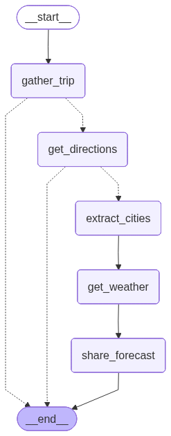

# Demo

This agent is implemented in Python using **LangGraph** and **A2A**.  

It follows a modular graph architecture with an A2A handler for JSON-RPC requests.

## Graph Visualization

The following diagram illustrates the flow of the graph:



## Example Request with A2A

You can send a message to the agent using `curl`:

```shell
curl --location 'http://localhost:8000/a2a' \
--header 'Content-Type: application/json' \
--data '{
  "jsonrpc": "2.0",
  "id": 1,
  "method": "message/send",
  "params": {
    "message": {
      "message_id": "1",
      "role": "user",
      "parts": [
        {
          "kind": "text",
          "text": "I'd like to travel from Atlanta to Nashville"
        }
      ]
    }
  }
}'
```

## Demo with Gradio UI

Follow the steps:
1. Run the server `make run`
2. Run gradio `python demo/ui_gradio.py`
3. Make requests with the chat window

